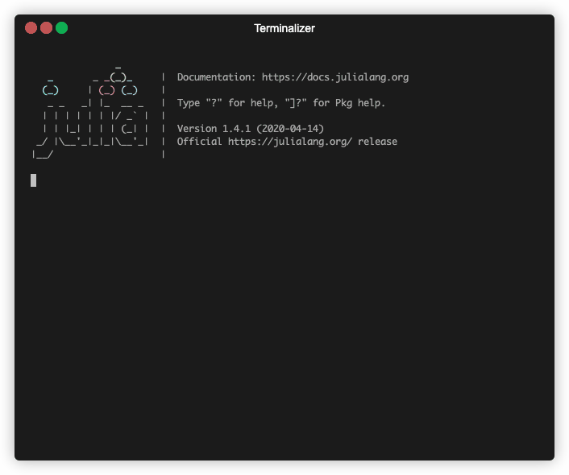

# YaoLang

[](https://travis-ci.com/QuantumBFS/YaoLang.jl)
[](https://coveralls.io/github/QuantumBFS/YaoLang.jl?branch=master)

The next DSL for Yao and quantum programs.



This package is currently in release alpha, and is not included in [Yao](https://github.com/QuantumBFS/Yao.jl), expect some adventures and rough edges. Please feel free to open an issue.

## Installation

<p>
YaoLang is a &nbsp;
    <a href="https://julialang.org">
        
        Julia Language
    </a>
    &nbsp; package. To install YaoLang,
    please <a href="https://docs.julialang.org/en/v1/manual/getting-started/">open
    Julia's interactive session (known as REPL)</a> and press <kbd>]</kbd> key in the REPL to use the package mode, then type the following command
</p>

```julia
pkg> add YaoLang
```

## License

YaoLang is released under the Apache 2 license.
